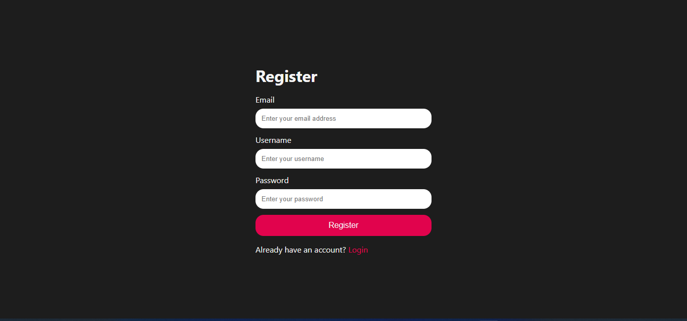
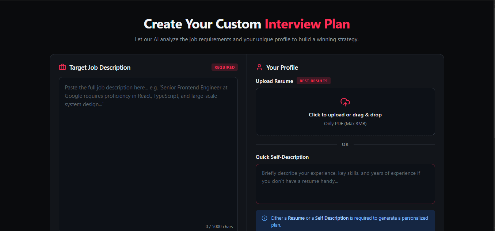
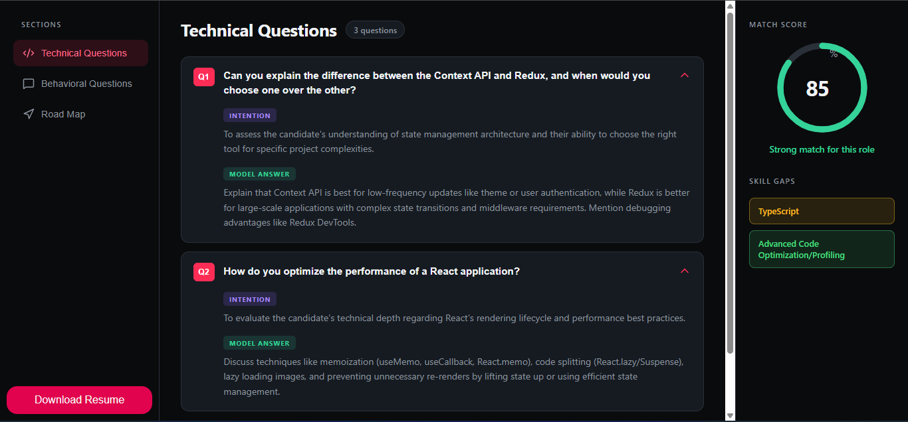
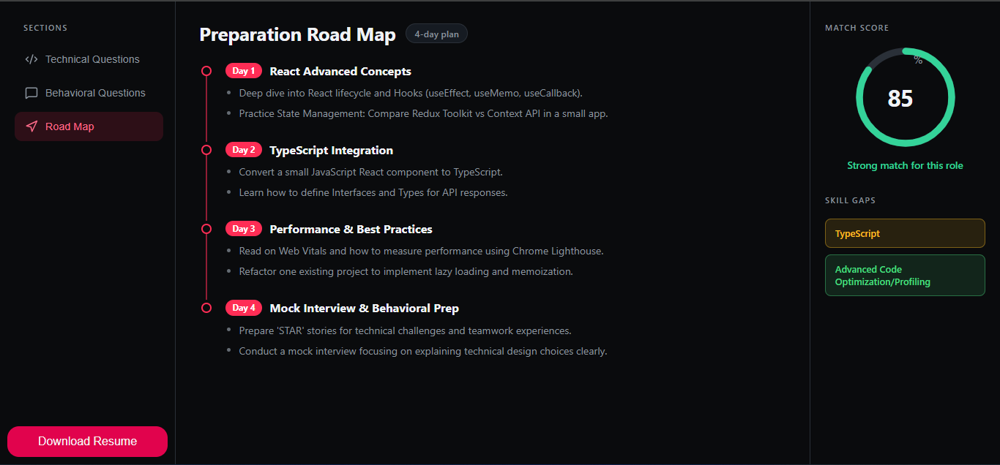

# 🚀 AI Job Preparation Platform

An AI-powered job preparation platform built with the **MERN Stack** and **Google Gemini API** to help candidates prepare smarter for their dream jobs. The application analyzes a candidate's resume, self-description, and target job description to generate personalized interview preparation plans, identify skill gaps, and create ATS-friendly resumes tailored to specific roles.

---

## ✨ Features

- 🔐 Secure user authentication and authorization
- 📄 Upload resume in PDF format
- 💼 Submit a target job description
- 👤 Provide a personal self-description
- 🤖 AI-powered resume analysis using Google Gemini
- 📊 Skill gap analysis with role match score
- 📚 Personalized preparation roadmap
- 💻 Technical interview questions based on the target role
- 🗣️ Behavioral interview questions with preparation guidance
- 📑 Generate professional ATS-friendly resumes tailored to each job
- 📝 View and manage previously generated interview reports
- 📱 Responsive and modern user interface

---

## 🛠️ Tech Stack

### Frontend
- React.js
- React Router
- Tailwind CSS
- Axios

### Backend
- Node.js
- Express.js

### Database
- MongoDB
- Mongoose

### AI
- Google Gemini API

### Authentication
- JWT (JSON Web Token)
- HTTP-Only Cookies

### Other Tools
- Puppeteer (ATS Resume PDF Generation)
- Multer (Resume Upload)
- PDF Parser

---

## ⚙️ How It Works

1. Create an account and log in securely.
2. Upload your resume in PDF format.
3. Paste the job description you want to apply for.
4. Add a brief self-description.
5. AI analyzes your profile against the job requirements.
6. Receive:
   - Match Score
   - Skill Gap Analysis
   - Personalized Preparation Plan
   - Technical Interview Questions
   - Behavioral Interview Questions
7. Generate a professional ATS-friendly resume tailored to that specific job.
8. Access all previously generated reports from your dashboard.

---

## 📸 Features Preview

### User Registration


### Create Custom Interview Plan


### Technical Interview Questions


### Personalized Preparation Road Map


---

## 🚀 Installation

### Clone the repository

```bash
git clone https://github.com/smabdurrehmanshah/Job_Preparation_Gen_AI
cd your-repository
```

### Install dependencies

Frontend

```bash
cd client
npm install
```

Backend

```bash
cd server
npm install

```

### Run the project

Backend

```bash
npm run dev
```

Frontend

```bash
npm run dev
```

---

## 📂 Project Structure

```
Job-Preparation-App
│
├── client
│   ├── src
│   ├── public
│   └── ...
│
├── server
|     |──src
│         ├── controllers
│         ├── models         
│         ├── routes
│         ├── middleware
│         ├── services
│         └── ...
│
└── README.md
```

---

## 🎯 Future Improvements

- AI mock interview with voice interaction
- Resume version history
- Cover letter generation
- Company-specific interview preparation
- Interview performance analytics
- Multi-language support

---

## 🤝 Contributing

Contributions are welcome! Feel free to fork the repository, create a feature branch, and submit a pull request.

---

## 👨‍💻 Author

**Abdur Rehman Shah**

If you found this project helpful, consider giving it a ⭐ on GitHub!